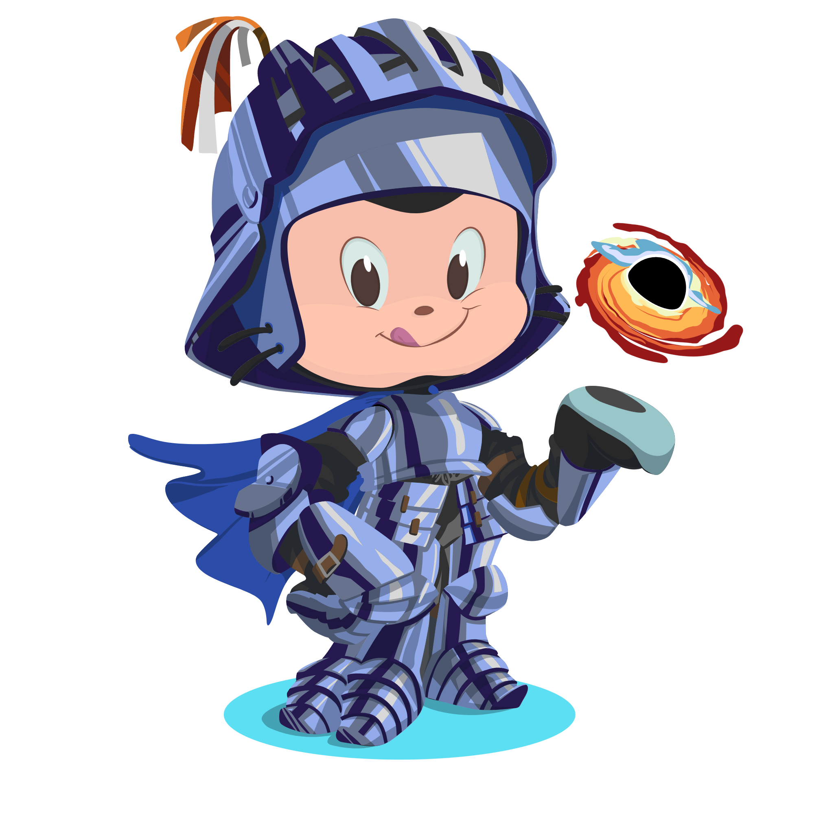

<!--  -->

<!-- <h3 align="center">Aakash</h3> -->
 

<!--  -->

<!-- <h1 style="font-size:35px;font-weight:bold"> <b>About Me</b> </h1> -->

    
    
    
    

  <!--  -->
  

    Hey! 👋 I’m <b>Akash</b>, also known as <b>Xynax</b>, a coder from India driven by <b>Artificial Intelligence, Machine Learning</b> and <b>Data Science</b>.
    I love diving into complex algorithms and transforming data into <b>impactful projects</b> that solve problems and inspire innovation.
    Off the keyboard, I’m either vibing to music or immersed in the storytelling craft of cinematography.
  

    

    
    
    
    
    
    
    
    
    
    
    
    
    
    
    
    
    
    
    
    
    
    
    
    

 

    <i>I’m <b>deeply passionate</b> about creating <b>innovative solutions</b> and bringing <b>impactful ideas</b> to life. If you’re excited to build something <b>truly extraordinary</b> or collaborate on a <b>meaningful project</b>, let’s connect and create something <b>remarkable</b>.</i>

    
    
    
    
    <!-- <a href="https://<your-portfolio-url>" title="Portfolio">
        
    </a> -->
     

  

