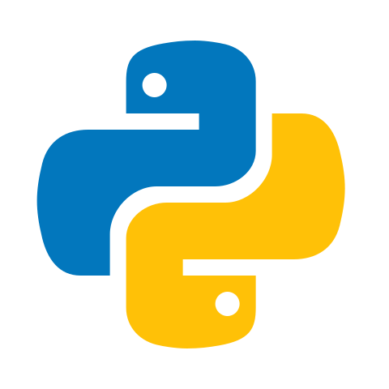

 

  

    Hey there! I'm <b>Akash</b> aka <b>Xynax</b>, an <b>AI/ML Engineer</b> from India who transforms ideas into intelligent systems. From training deep learning models to building production-ready LLM applications with agentic workflows, I love the entire journey—data to deployment. 
    
I integrate ML models with modern full-stack architectures using FastAPI, Flask, Django, and React, automate complex pipelines with n8n, and ship apps that actually work. When I'm not coding, you'll find me vibing to music or appreciating cinematography.
  

 

<!-- 
tracking progress, one commit at a time
 -->

    

 

<!-- 
Everything I use to build intelligent systems
 -->

 

    
    
    
    
    
    
    
    
    
    
    
    
    
    
    
    
    
    
    
    
    
    
    
    
    
    
    
    
    
    
    
    
    
    
    
    
    
    
    
    
    
    
    
    
    
    
    
    
    
    
    
    
    
    
    
    
    
    

 

<!-- 

## Featured Projects

some things I've built that I'm proud of

<table>
<tr>
<td width="50%">
 

 

 

<b>🔥 Highlights:</b> 
• Retrieval-Augmented Generation with vector search 
• Custom embeddings pipeline for domain-specific data 
• Production API with rate limiting and caching 
• Deployed on cloud with auto-scaling

</td>

<td width="50%">
 

 

 

<b>🔥 Highlights:</b> 
• Multi-agent system with tool calling capabilities 
• Automated decision-making with LLM reasoning 
• n8n workflow orchestration for complex tasks 
• Webhook integrations with Slack & Gmail

</td>
</tr>

<tr>
<td width="50%">
 

 

 

<b>🔥 Highlights:</b> 
• Custom CNN architecture trained from scratch 
• Real-time image processing with WebSocket 
• React frontend with drag-and-drop interface 
• Docker containerized for easy deployment

</td>

<td width="50%">
 

 

 

<b>🔥 Highlights:</b> 
• MLflow for experiment tracking & model registry 
• Automated retraining with data drift detection 
• CI/CD pipeline with automated testing 
• Monitoring dashboard with Grafana

</td>
</tr>
</table>

 -->

 

    I'm passionate about building AI systems that solve real problems. Whether it's training custom models, integrating LLMs into production apps, or automating complex workflows—I'm always down to collaborate on something impactful. Let's build 🚀

 

---

Made with 💌 by <b>Xynax</b> | <i>Last updated: November 2025 v2.0 </i>

  

